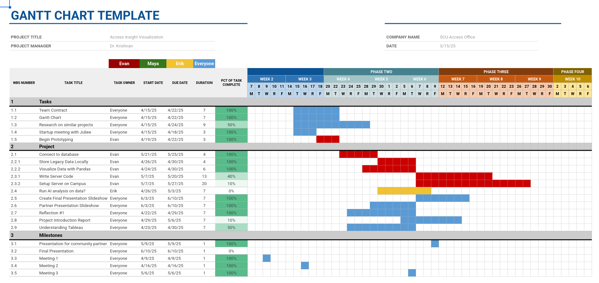

Read weekly updates on what progress is being made. Our weekly progress is tracked using a gantt chart (last update 5/11/25):

<!-- Individual 'blog' page (or subpage) which reflects your personal efforts and -->
<!-- contributions towards team activities. Note: this can be a subpage of the -->
<!-- 'Project' page or its own entity, however it makes sense to you to organize -->
<!-- this information! -->

## Posts
- [Week 2](./week-2.html)
- [Week 3](./week-3.html)
- [Week 4](./week-4.html)
- [Week 5 - Reflection](./week-5.html)
- [Week 6](./week-6.html)
- [Week 7](./week-7.html)
- [Week 8](./week-8.html)

